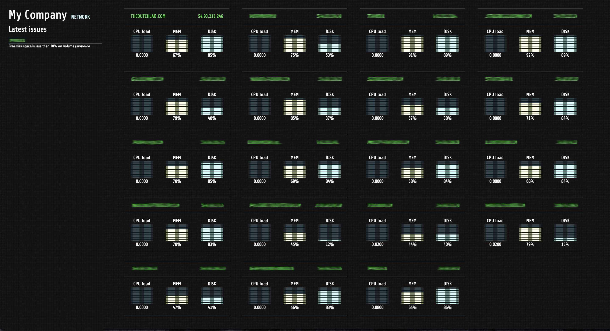

# Nodefront

Simple Node.js server dashboard for Zabbix or New Relic.

This is a working, but very basic and unstable/unreliable (nice disclaimer ey?) dashboard for Zabbix or New Relic monitoring.

In december 2014 I came across this post: https://www.phyramid.com/blog/monitoring-servers-at-phyramid/
Heavily inspired by it, and primarily because I did not want to wait for a release I decided to try and build one myself.

Feel free to comment on code, create issues, let me know you're using it, whatever to show support and let me work on my JS skills.

## Install

This is a basic express.js app without the node modules in git. Install should be no issue once you have the node modules installed using "npm install".

## Development

```
nodemon bin/www
```

## Production

Run as you wish, the below is an option on how to do it using Crontab

```
crontab -u youruser -e
```

In your crontab

```
@reboot /usr/local/bin/forever start /home/youruser/path/to/your/app.js
```

(Source: http://stackoverflow.com/questions/13385029/automatically-start-forever-node-on-system-restart)

## Env variables

### Required environment variables

* company_name
* data_source (zabbix or new_relic)

Required environment variables for platform (choose to fill Zabbix or New Relic based on which one you need)

### For Zabbix

* zabbix_endpoint (ie: http://zabbix.mycompany.com/api_jsonrpc.php)
* zabbix_user
* zabbix_pwd
* zabbix_group_ids (supports only one group id (for now), ie 1)

### For New Relic

* new_relic_servers_endpoint (ie: https://api.newrelic.com/v2/servers.json)
* new_relic_apikey (You can find it on NR: your account -> integrations -> data sharing)

## Refresh rate

Refresh rate is set in the zabbix.js or new_relic.js files for now.



# Todo

Quite a lot already...

* Doublecheck if all values used are really OK.
* Alert/Issue data for New Relic
* Set and Update CPU bars
* UI support for many hosts
* Tests ( I know, should be there already. )
* Proper error messages if environment data isn't correct
* Refactor with respect to many js and node.js best practices.
* More (general) UI enhancements
* More than webkit only browser support

# Changelog

### 0.0.2
* Introduced bigger graphs
* basic rotating logic to rotate server data if there are many hosts to monitor.

### 0.0.1
* First release (After Zabbix I've decided to add NR support too, which might show...)
